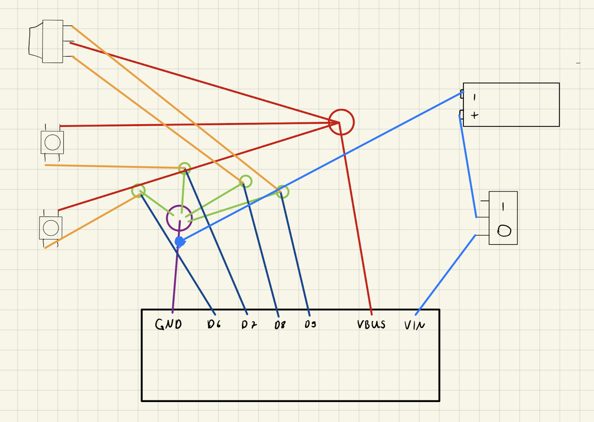
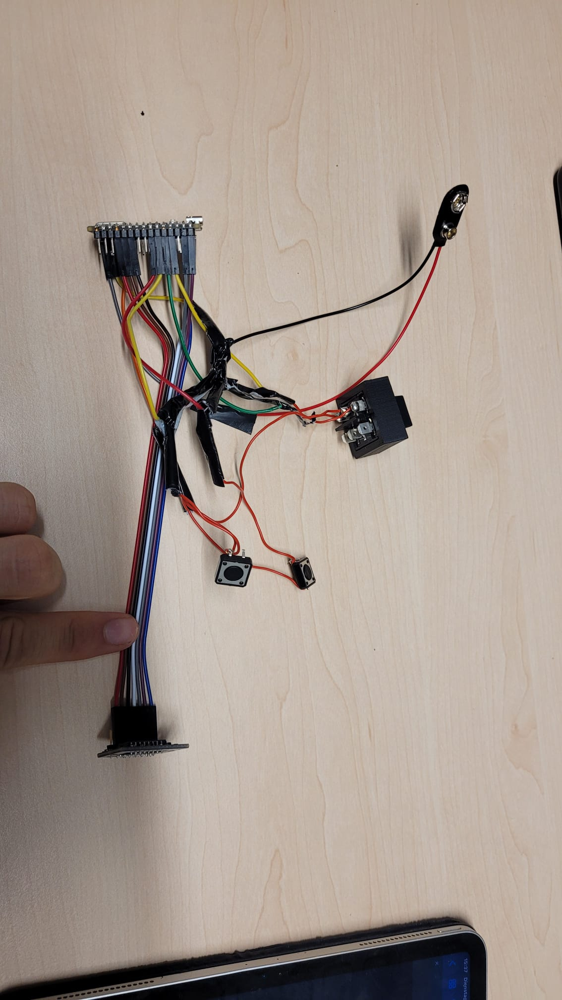

# PhysComp SS24 - SpatialMouse - Electronics

# Custom Sensor Integration

This project demonstrates the integration of custom sensors with a microcontroller board.

## Wiring Diagram

The included wiring diagram illustrates the connections between various components:

- Multiple sensor inputs (D6, D7, D8, D9)
- Power supply (VBUS)
- Ground (GND)
- Power supply (VIN)
- Additional modules (represented by rectangular blocks)

While the diagram is a simplified representation, it communicates the overall connection scheme, allowing for quick understanding and implementation.

## Physical Implementation

The accompanying photo shows the actual wiring implementation. Key features include:

- Multi-colored wires for easy identification
- Compact wiring layout to minimize space requirements
- Use of standard connectors for modularity and ease of assembly/disassembly

This physical setup demonstrates the transition from concept to practical application.

{width=500px}

{width=500px}
