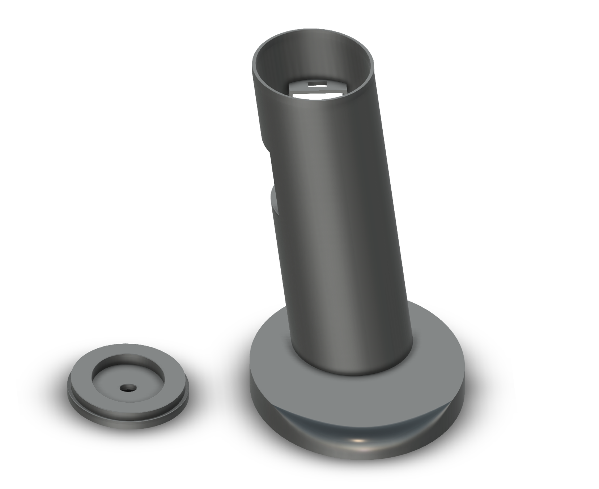
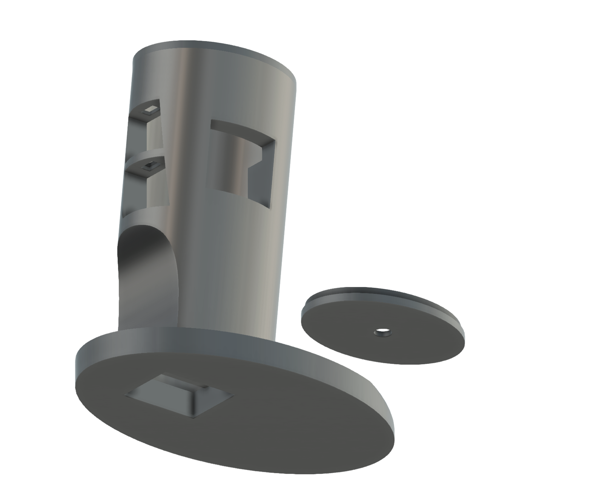
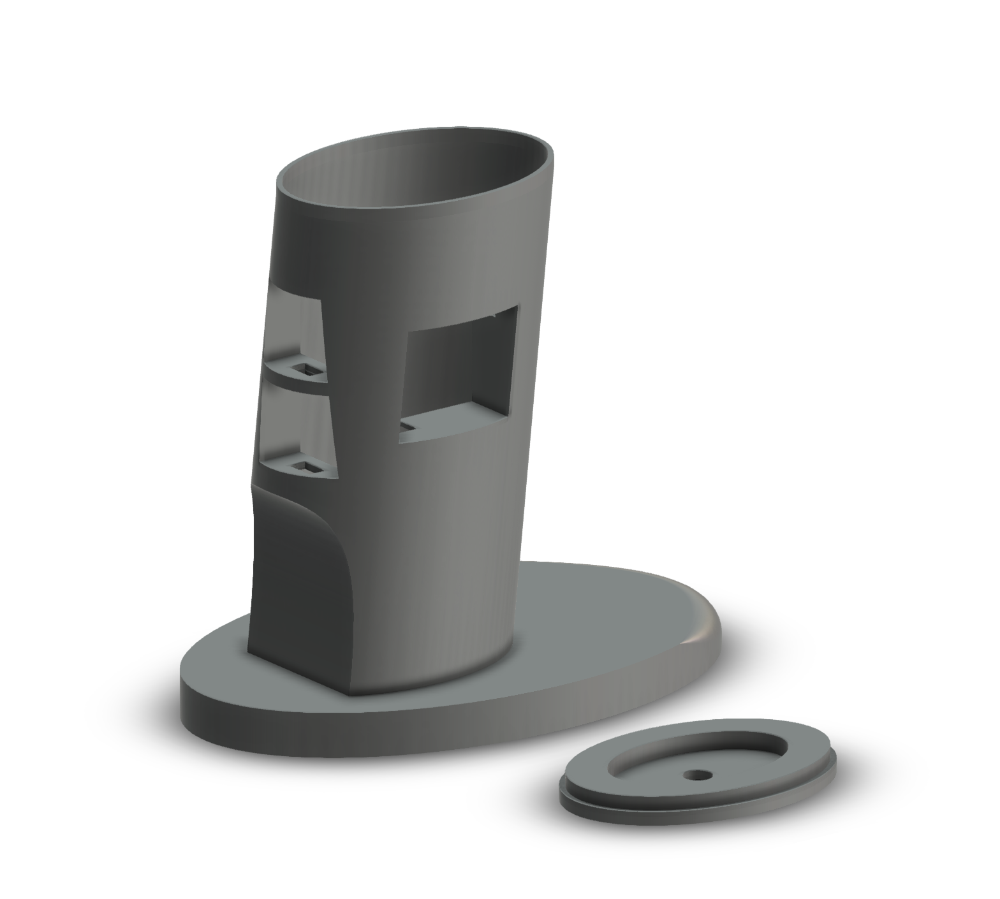
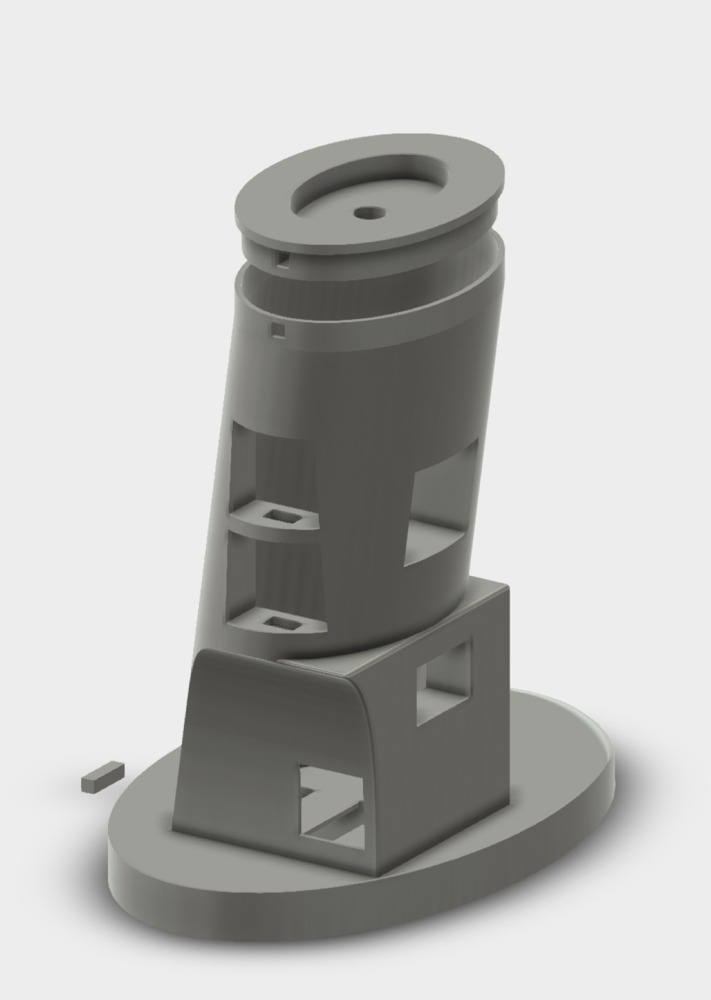

# PhysComp SS24 - SpatialMouse - Mechanical

Below you'll find images and the Fusion 360 code for the 3D model of our second iteration Spatial Mouse prototype:

{width=500px}

{width=500px}

{width=500px}

This is our newes iteration of the 3D model for the Spatial Mouse:

{width=500px}

