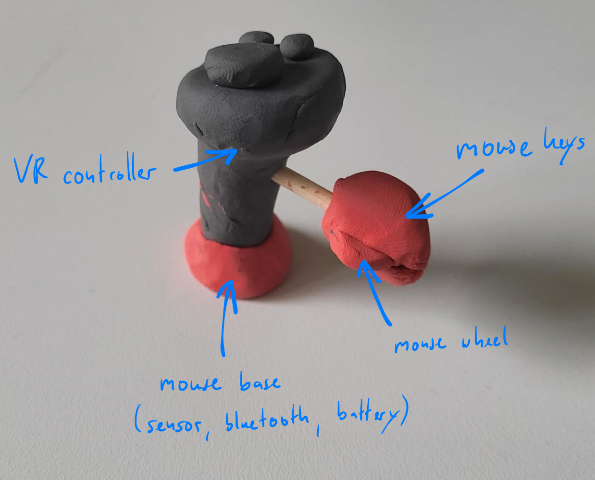
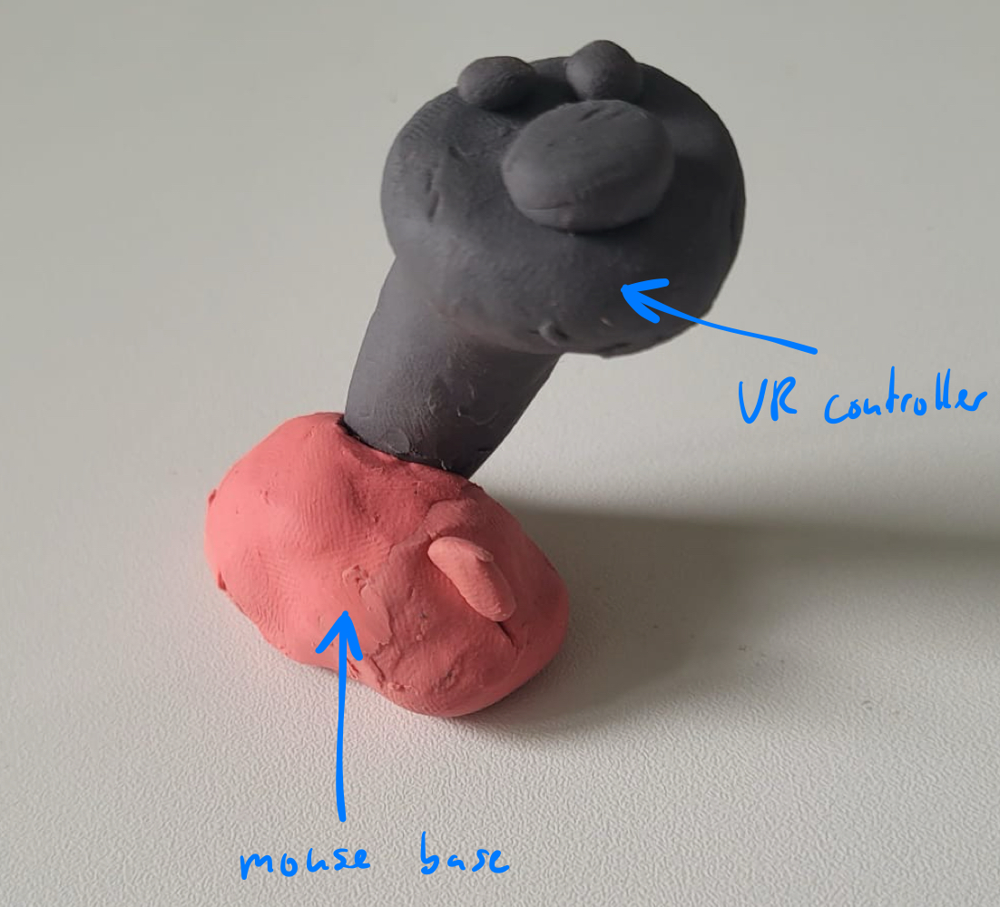
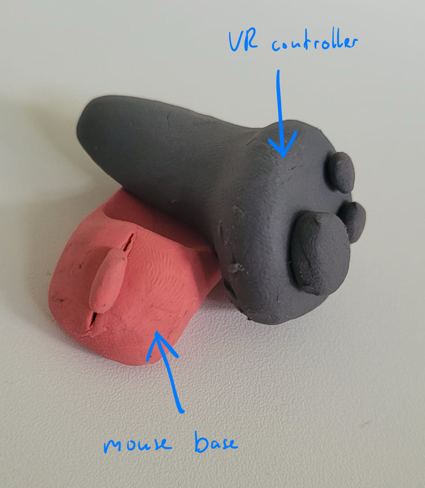
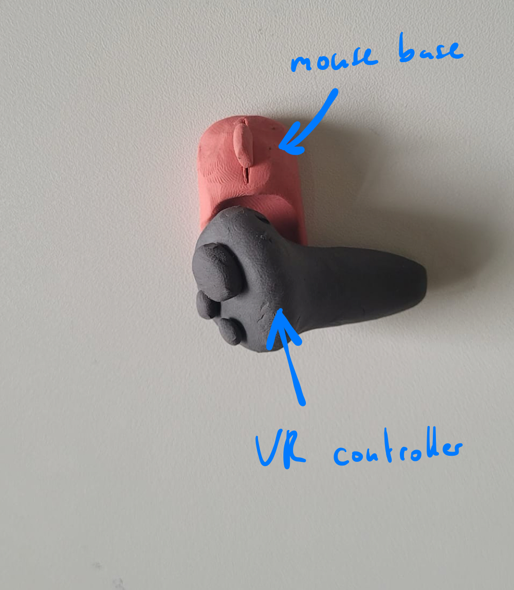
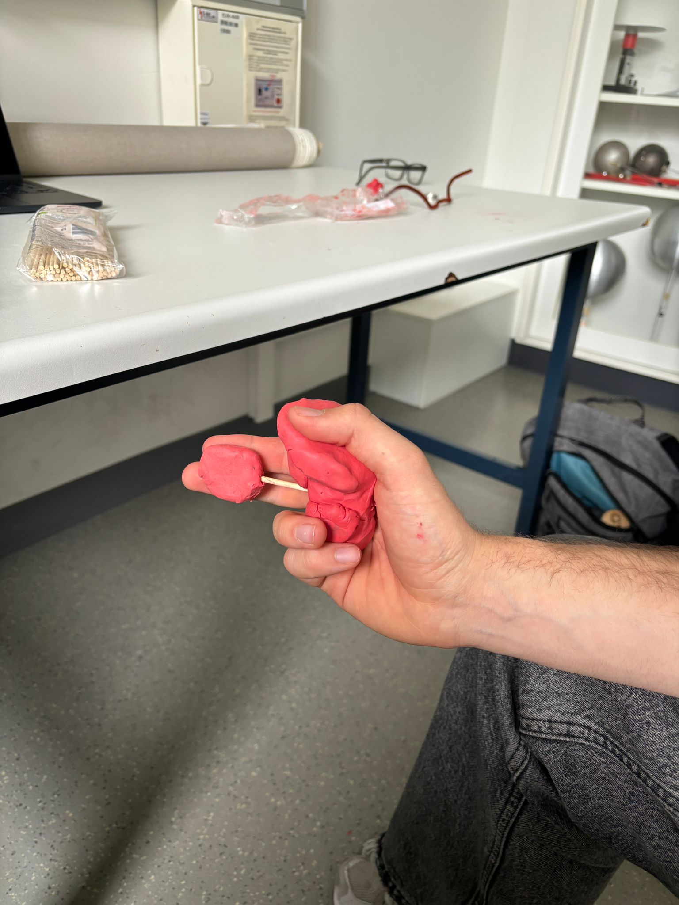

# PhysComp SS24 Assignment - Week 3

> **Deadline:** 07.05.2023, 23:59 CEST

## Weekly Progress Report

1. **First concept:** 

We started by brainstorming different ideas and concepts in order to create viable sketches and to rule out poor design choices. To achieve this, we focused on asking ourselves "What is important?". By asking that question repeatedly, we found that ease of use, low weight and ergonomic feeling should be our main priorities, since users will likely hold the device in their hands for a prolonged period of time.

Regarding our sketches, we designed them by forming them out of knead. We found this to be the best approach, as we could easily check how they feel inside a users hand.  This would not have been possible with drawings. We created 4 different models, which were the results of our brainstorming session.

{width=400px}
{width=400px}
{width=400px}
{width=400px}
{width=400px}

{width=800px}

Picture 1: User (wearing a VR-Glasses) using a mouse

Picture 2: The user has to take down the VR-Glasses in order to switch to the VR-Controller

Picture 3: User using a VR-Controller as input device

Picture 4: User has to take down VR-Glasses again in order to switch the input device

Picture 5: 2-in-1 Spatial-Mouse gets handed to the user

Picture 6: User throws Mouse and VR-Controller in the trash

Picture 7: User using Spatial-Mouse as a mouse

Picture 8: User using Spatial-Mouse as a VR-Controller

2. **Objects/Idea Collection:** 

{width=400px}
{width=400px}
{width=400px}
{width=400px}
{width=400px}

3. **First component list** 

| Item                   | Status             | Example |
|------------------------|--------------------|-----------|
| VR Controller          | Already ordered    | - |
| Mouse (Bluetooth)      | Already ordered and arrived | - |
| Modelling material (Knead) | Not yet ordered | https://rb.gy/tvhnu7 |
| 3D printing material   | Not yet ordered   | https://rb.gy/vp8pg3 |

