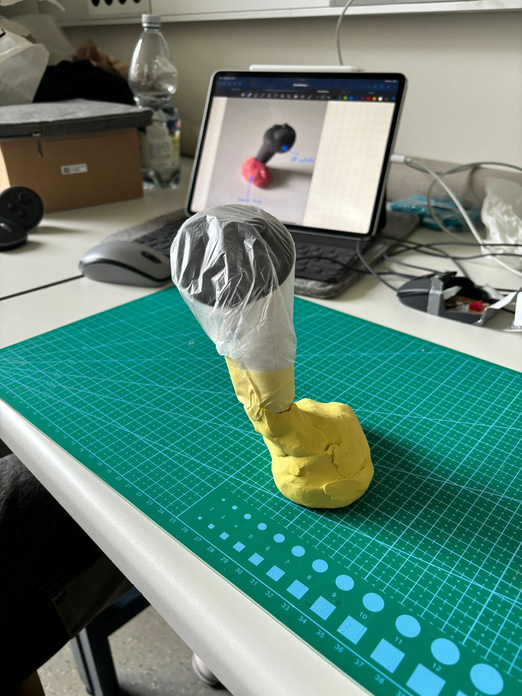

# PhysComp SS24 Assignment - Week 4

> **Deadline:** 14.05.2024, 23:59 CEST

## Weekly Progress Report

1. **Progress report:**

    We continued to think about our prototype. After brainstorming a little, we looked for an old plastic film to protect the VR controller we brought today. With the wrapped-up controller, we tried out different creations of how we could combine it with a modified mouse.

    {width=200px}

    After a talk with Prof. Feutner we decieded to change our plans. While we were previously focusing on combining a mouse and a VR-Controller, we tried to deviate from this idea and tried to think more "outside the box". By planning on building the device ourselves (instead of just using a existing VR-Controller), we were able to come up with more unique shapes and new solutions (picture below). This week, we successfully thought about what would be needed to build our prototype. We especially focused on the components that we need for this task. The main change is, that we have a completely new shape, rather than working with finished products.

    {width=800px}

    In this picture one can see our first ideas of how the Spatial Mouse could look like. One can also see the major differences compared to having the computer mouse and VR-Controller combined.

    Unfortunately, we were unable to find exact models of all the components we need. Some hardware components (such as the mouse sensor) are hard to find. Furthermore, while we have a good general understanding of what we are trying to achieve, we did not yet go into very much detail. Part of the reason is, that going into detail requires us to know our hardware components. 

    Our plans for next week are to finish the list of hardware components that we need to order and to decied on one of the shaped for our first prototype (At the moment we are leaning towards the right one).

    **Norman's Design Principles:**

    Visibility: We have made the buttons and switches on the device clearly visible and easily distinguishable. The input buttons (primary and secondary trigger) shall be placed in similar locations compared to a traditional VR-Controller, making the purpose evident to the user.

    Feedback: We incorporate tactile feedback into the buttons and switches, providing a satisfying click or bump when activated. While a traditional VR-Controller has buttons with gradual pressability, we will for now focus on "all or nothing" buttons, for improved feedback.

    Constraints: We have designed the device with physical constraint that guide the user's actions. The shape and size of the device naturally fit the user's hand, encouraging a comfortable and ergonomic grip. Furthermore, the mouse plate at the bottom does not allow for any other sensable way of putting the device on the table, other that how it is intended to be placed.

    Mapping: We have mapped the devices controls to closely match the user's expectations and mental models. The input buttons will be placed similarily to the buttons of traditional VR-Controllers, and the mouse wheel will have an almost identical shape compared to traditional mouse wheels, following established conventions and best practices.

    Constistencty: The behaviour of the buttons shall remain consistent in each mode. For example, one mouse button should always be for left click, while the other button should always be for right click. In VR mode, the buttons consistently map to specific actions or functions within the virtual environment, such as grabbing objects or navigating menus.

    Affordance: The physical design of the device affords its intended use. The shape and form factor of the stick suggest that it can be gripped and manipulated like a handheld controller. The flat mouse plate on the bottom affords placement on a desk surface for mouse functionality. The buttons and switches are sized and shaped to invite pressing, clearly indicating their interactive nature.

    Siginifiers: We have included clear signifiers on the device to communicate its capabilities and mode of operation. The mode switch button shall be distinctively marked to signify its purpose. The device's overall appearance and branding shall signify its dual functionality as a VR-Controller and computer mouse.

2. **Refined component list:** 

| Item                   | Status             | Example |
|------------------------|--------------------|-----------|
| Vive Tracker         | Present at University    | - |
| Arduino ESP 32     | Not yet ordered | https://shorturl.at/juJKL |
| Mouse Sensor (including breakout board) | Not yet ordered | Still searching for an example, hard to find |
| 3D printing material   | Present at University   | - |
| Buttons   | Still deciding which types we need   | - | 
| Battery   | Not certain which power supply is needed   | - |

Note: The main components (which have to be ordered) are the Arduino ESP 32, the mouse sensor and the breakout board. 
We expect to find everything else at the University (at least everything that we think is needed so far, such as cables etc.). Next week, we'll take a closer look at our component list and aim to wrap it up.

