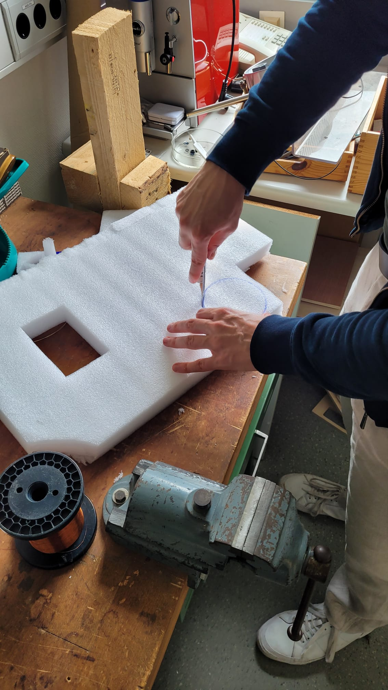
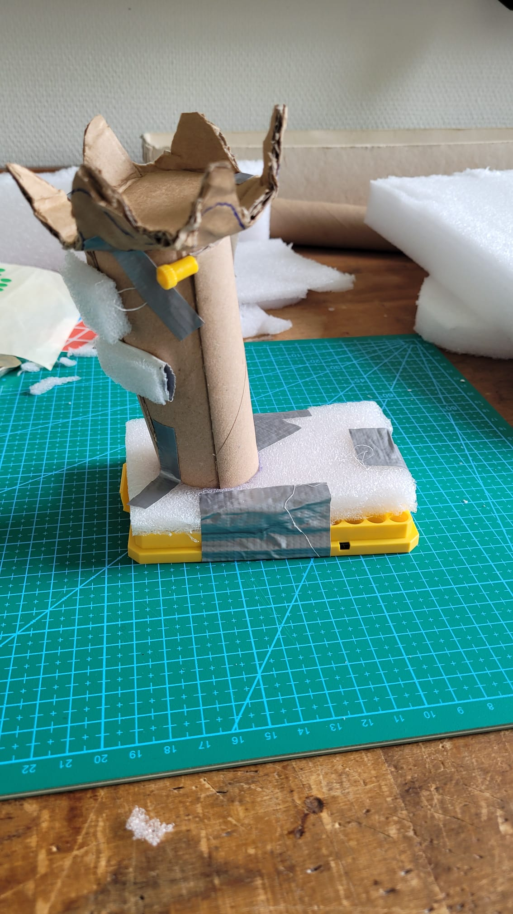

# PhysComp SS24 Assignment - Week 5

> **Deadline:** 21.05.2024, 23:59 CEST

## Weekly Progress Report

1. **Project Concept**

    After our presentations, we first discussed the feedback we received. Then, we went downstairs to gather some materials for building a prototype of our new design idea. Once we found the materials we needed, we quickly started working on the sketch.
    
    {width=300px}

    Figure 1: Creating our first physical prototype based on our new design.
    
    {width=300px}

    Figure 2: Finished the first physical protoype. White buttons in the front, plate for mouse sensor at the bottom, yellow pin representing the mouse wheel.
    The crown on top represents the vive tracker.
    
    We were satisfied with the result, especially since we were unsure about how the mouse positions would feel. One problem we realised after building the prototype was that different hand sizes affect how well you can use the spatial mouse. We will have to find a way to allow hands of different sizes to comfortably grab the spatial mouse.

    After building our prototype, we talked to two other groups, exchanged feedback, and showed both of them our paper model of the spatial mouse. This was helpful as it provided additional feedback and led to interesting discussions about our design choice. We also tested the tilted (visible in the picture of our prototype) design which was suggested as feedback by group 4 and were surprised by the difference regarding the feeling when one is grabbing onto the device. Due to the small tilt, the spatial mouse feels more natural and the stress on the users wrist is reduced.

    Unfortunately, we did not have time to discuss the component list. We will try to focus on that again in the future.

2. **Current component list:** 

| Item                   | Status             | Example |
|------------------------|--------------------|-----------|
| Vive Tracker         | Present at University    | - |
| Arduino ESP 32     | Not yet ordered | https://shorturl.at/juJKL |
| Mouse Sensor (including breakout board) | Not yet ordered | Still searching for an example, hard to find |
| 3D printing material   | Present at University   | - |
| Buttons   | Still deciding which types we need   | - | 
| Battery   | Not certain which power supply is needed   | - |

Note: The main components (which have to be ordered) are the Arduino ESP 32, the mouse sensor and the breakout board. 
We expect to find everything else at the University (at least everything that we think is needed so far, such as cables etc.). Next week, we'll take a closer look at our component list and aim to wrap it up.

## Feedback Report
1. **Concept Presentation**

We received helpful and insightful feedback on our concept presentation. First, feedback was given regarding the buttons (user inputs) of our device.
While we already thought about not using buttons with gradual feedback on purpose, clues were given about which button would be serving as the left or right mouse click respectively. By asking the question "Which button do you plan on using for the left mouse click?" it was brought to our attention that we did not yet think this through enough and we might need to spend a little bit more time on that matter.

Next, it was mentioned that the spatial mouse may lead to an urge of lifting the device even when making use of the computer mouse use case. This would be far from ideal. However, when handing the prototype to other groups, we were not able to confirm this feedback. So while we will keep an eye out for this issue, we are not going to immediately deal with it, since it may not actually be a problem when using the device.

Lastly, we received feedback on the general design of our spatial mouse. We were asked what other shapes there might be, since the shapes of our prototypes were either strongly inspired by a computer mouse or by a VR controller. This feedback was familiar, since this was our main issue for the past two weeks. We were asked again for "outside of the box" solutions. 

Regarding solutions, one might be able to incorporate buttons which support two modes. One with tactile feedback, as well as one mode where the buttons only give gradual feedback. The user can then switch between the two modes, depending on which feedback he wants to receive upon pressing the buttons. Furthermore, one can think about new shapes again. Although we already thought about shapes extensively, there might be creative and ideally suited designs which we did not yet uncover. However, this would only be hypothetical, since after evaluating thoroughly, our current design is the most promising solution.

2. **Peer Evaluation**

For the peer evaluation we partnered up with Group 2 and 4.

With both groups we handed over our prototype and allowed them to play around freely, without giving them too many hints about how the device is intended to be used. Fortunately, both groups intuitively grabbed the device in the way it was intended to, placing their fingers on the correct buttons. This was a "silent" feedback for us, that the current shape of our spatial mouse successfully invites for a correct usage.

Both groups mentioned the ergonomic feeling during usage. While group 4 only suggested we might incorporate a small tilt for a more natural feeling, group 2 was sceptical at first regarding the vertical use of a computer mouse. They mentioned that a user might need some time to adjust to this new way of interacting with a computer mouse, but agreed that this might be a less significant issue when we showed them that there are vertical computer mouses for ergonomical reasons on the market. Another suggestion was that maybe one can achieve a design, were the user can turn the device in order to be able to use the mouse in the traditional position (horizontal), i.e. by turning the device 90 degrees, while making sure that the user does not have to change his grip. This feedback was again driven by the way in which they currently interact with a computer mouse but confirmed our assumption, that the ability to have one grip for both use cases is an essential feature and should be focused during further development of our prototype. 

Regarding given feedback for group 4, we evaluated the position of their control panel. While it is easily accessible when located on one of the arm pits, the arm pit can no longer be used to rest on. We suggested sticking it to the side of an arm pit and allow it to be flipped up and down when it is (not) needed. We also questioned the use case of the "lost chair" function, which shall allow the chair to come to the user on its own. We argued that we do not think that this feature will be used frequently, since we do not ask ourselves "where is my chair right now?". Almost every time we exactly know where our chair is located. Group 4 appreciated our feedback and told us, the feature could be useful for blind people. We agreed to the usefulness of such a feature for blind users, but also mentioned that blind users cannot really interact with a control panel which is not adapted to blind users, so they should pay attention to this detail. 

Group 2 asked our opinion on where to put the electronics in their device. While their current favourite was a circular plate on the bottom of the glass, we argued that this design can lead to several problems. Firstly, one has to be careful not to make the device too heavy. Users will lift the glass frequently and when the glass becomes too heavy, a user might be annoyed. Secondly, the circular plate had a larger diameter than the glass itself (at least in their prototype). In our feedback we mentioned that tables can be quite full with plates, multiple wine (and normal) glasses, forks, etc. So it would be ideal if the device does not need any additional horizontal space (vertical space is less tragic in our opintion). All in all our feedback focused on the importance of keeping the size which needs to be added to the glass to a minimum.
