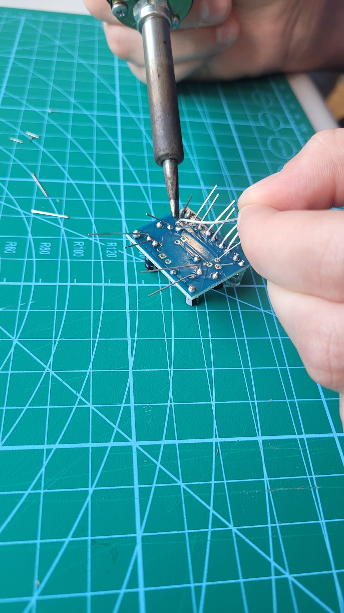
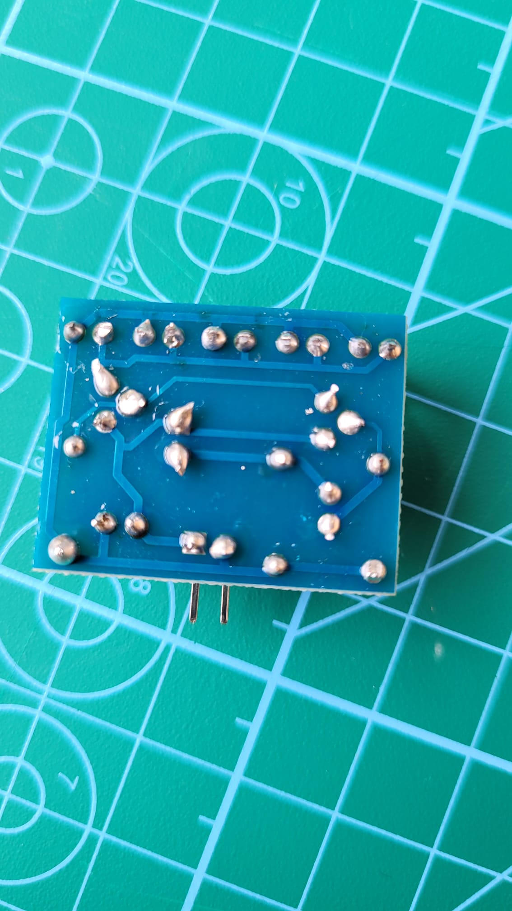
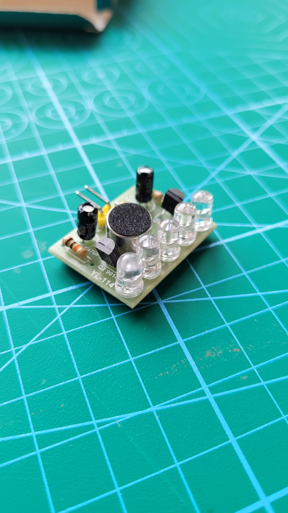

# PhysComp SS24 Assignment - Week 7

> **Deadline:** 11.06.2024, 23:59 CEST (Sorry, assignment was delayed. Deadline is extended.)

## Weekly Progress Report
1.	**Soldering exercise**: Report on your soldering exercises (pictures and text). What was your experience, what challenges did you face, what was the outcome?

### Soldering Project Summary

The soldering exercise was really interesting and helpful. Unfortunately, Cedric could not join us this week, so Robin worked with Paulina in the three-person group.

Following the instructions from the video, we began soldering all the components together. We carefully ensured that each component was placed in the correct spot.

{width=300px}

*Picture of the last component being soldered to the board*

After completing the soldering, we connected the board to a power source to check if it worked correctly. It did! We then trimmed all the unnecessary metal pieces, and the board looked like this:

  
  

*The back and front of the board*

Afterwards, we tested our final product to see how well it worked. We were very pleased with the results.

{width=300px}

2.	**Progress Report:** What have you achieved this week with regards to your project? As usual, if your *concept* has changed, briefly describe this (and post pictures). Also, report on your progress in *developing your prototype* or *acquiring equipment*.

This week, we continued searching for components and finalized our "want to oder" - collection. We ordered the remaining hardware devices, and the good news is that they will arrive before next week's session.

Unfortunately, this week we were still waiting for these componets we ordered, so we could not start to assable the hardware together. Next week, the fun will begin!
