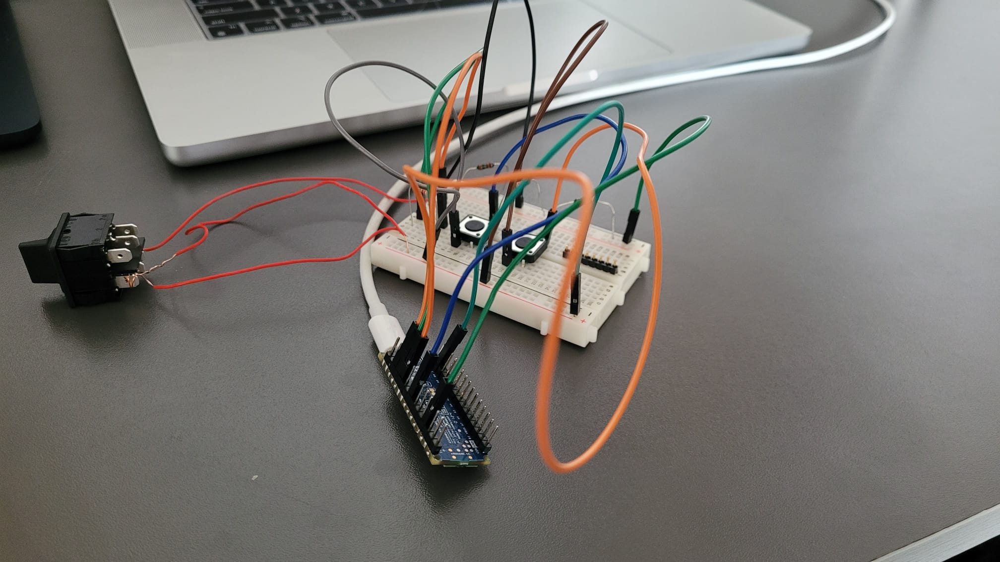
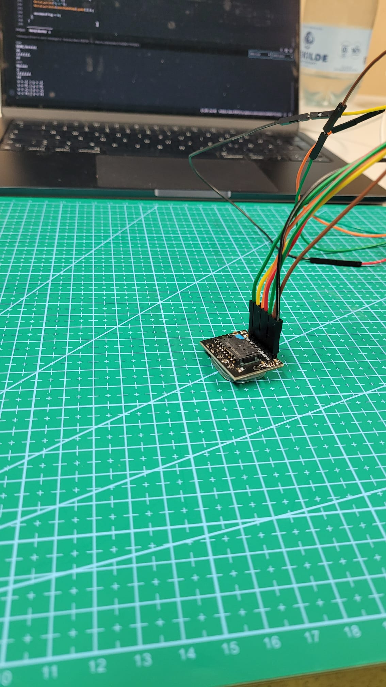

# PhysComp SS24 Assignment - Week 8

> **Deadline:** 18.06.2024, 23:59 CEST

## Weekly Progress Report
1.	**Progress Report:** What have you achieved this week with regards to your project? As usual, if your *concept* has changed, briefly describe this (and post pictures). Also, report on your progress in *developing your prototype* or *acquiring equipment*.

This week the mouse sensor finally arrived and we were able to start off with our first functionality tests. We started by testing every component (buttons, toggle switch, mouse sensor) individually in order to make sure how every single component works. During the test of the buttons which we ordered we found out that the state between "pressed" and "not pressed" is not well separated. That means if one pushes the button, instead of "not pressed" -> "pressed" -> "not pressed", the state switches multiple times during one press (e.g. "not pressed" -> "pressed" -> "not pressed" -> "pressed" -> "not pressed"). Since this is far from ideal for the usage in both a VR controller and computer mouse, we may need to replace the buttons with ones which have a clear tactile feedback.

{width=600px}

Additionally, we thought about how to implement the mouse wheel. Since in our design the mouse wheel is located at the side of our device, we ordered a tactile switch which (when not pressed) jumps back into a neutral position. The idea was to use a constant scroll speed when the switch is pressed up/down. However, since a substantial amount of force is required and the scroll speed cannot be altered, we are considering to replace the switch with a joystick for an improved scrolling experience. 

Furthermore, we were able to send bluetooth signals from our Arduino ESP32 Nano to our computers. We designed a left and right mouse button, and were able to use them as the input on our MacBooks. In order to emulate a complete computer mouse we then needed to get the mouse sensor to work. This was by far the most complicated part, since the sensor was the most complex hardware component until this point. 

{width=300px}

However, we were successful in getting the sensor to work and even using it as a mouse via Bluetooth.

{width=300px}

Most of the code was written by ourselves. For the PMW3389 Sensor we found a useful GitHub page, on which we found some code that helped us to setup the sensor.

**Our current code so far:**

<details>
<summary>Code</summary>

```cpp
#include <BleMouse.h>
BleMouse bleMouse;
#include <SPI.h>
#include <pgmspace.h>

// Registers
#define Product_ID 0x00
#define Revision_ID 0x01
#define Motion 0x02
#define Delta_X_L 0x03
#define Delta_X_H 0x04
#define Delta_Y_L 0x05
#define Delta_Y_H 0x06
#define SQUAL 0x07
#define Raw_Data_Sum 0x08
#define Maximum_Raw_data 0x09
#define Minimum_Raw_data 0x0A
#define Shutter_Lower 0x0B
#define Shutter_Upper 0x0C
#define Control 0x0D
#define Config1 0x0F
#define Config2 0x10
#define Angle_Tune 0x11
#define Frame_Capture 0x12
#define SROM_Enable 0x13
#define Run_Downshift 0x14
#define Rest1_Rate_Lower 0x15
#define Rest1_Rate_Upper 0x16
#define Rest1_Downshift 0x17
#define Rest2_Rate_Lower 0x18
#define Rest2_Rate_Upper 0x19
#define Rest2_Downshift 0x1A
#define Rest3_Rate_Lower 0x1B
#define Rest3_Rate_Upper 0x1C
#define Observation 0x24
#define Data_Out_Lower 0x25
#define Data_Out_Upper 0x26
#define Raw_Data_Dump 0x29
#define SROM_ID 0x2A
#define Min_SQ_Run 0x2B
#define Raw_Data_Threshold 0x2C
#define Config5 0x2F
#define Power_Up_Reset 0x3A
#define Shutdown 0x3B
#define Inverse_Product_ID 0x3F
#define LiftCutoff_Tune3 0x41
#define Angle_Snap 0x42
#define LiftCutoff_Tune1 0x4A
#define Motion_Burst 0x50
#define LiftCutoff_Tune_Timeout 0x58
#define LiftCutoff_Tune_Min_Length 0x5A
#define SROM_Load_Burst 0x62
#define Lift_Config 0x63
#define Raw_Data_Burst 0x64
#define LiftCutoff_Tune2 0x65

// Set this to what pin your "INT0" hardware interrupt feature is on
#define Motion_Interrupt_Pin 2

const int ncs = 3;  // This is the SPI "slave select" pin that the sensor is hooked up to

byte initComplete = 0;
volatile int xydat[2];
volatile byte movementflag = 0;

// Be sure to add the SROM file into this sketch via "Sketch->Add File"
extern const unsigned short firmware_length;
extern const unsigned char firmware_data[];

const int buttonLeft = 6;
const int buttonRight = 7;
// const int scrollUp = 8;
// const int scrollDown = 9;

int buttonStateLeft = 0;
int buttonStateRight = 0;
int scrollUpState = 0;
int scrollDownState = 0;

// Forward declaration of UpdatePointer function
void UpdatePointer();

void setup() {
  Serial.begin(9600);
  while (!Serial.availableForWrite())
    ;

  bleMouse.begin();

  pinMode(LED_BUILTIN, OUTPUT);
  pinMode(buttonLeft, INPUT_PULLUP);
  pinMode(buttonRight, INPUT_PULLUP);
  // pinMode(scrollUp, INPUT_PULLUP);
  // pinMode(scrollDown, INPUT_PULLUP);

  pinMode(ncs, OUTPUT);

  pinMode(Motion_Interrupt_Pin, INPUT_PULLUP);
  digitalWrite(Motion_Interrupt_Pin, HIGH);
  // attachInterrupt(digitalPinToInterrupt(Motion_Interrupt_Pin), UpdatePointer, FALLING);

  SPI.begin();
  SPI.setDataMode(SPI_MODE3);
  SPI.setBitOrder(MSBFIRST);
  SPI.setClockDivider(SPI_CLOCK_DIV128);

  performStartup();

  delay(5000);

  dispRegisters();
  initComplete = 9;
}

void adns_com_begin() {
  digitalWrite(ncs, LOW);
}

void adns_com_end() {
  digitalWrite(ncs, HIGH);
}

byte adns_read_reg(byte reg_addr) {
  adns_com_begin();

  // Send address of the register, with MSBit = 0 to indicate it's a read
  SPI.transfer(reg_addr & 0x7f);
  delayMicroseconds(100);  // tSRAD
  // Read data
  byte data = SPI.transfer(0);

  delayMicroseconds(1);  // tSCLK-NCS for read operation is 120ns
  adns_com_end();
  delayMicroseconds(19);  //  tSRW/tSRR (=20us) minus tSCLK-NCS

  return data;
}

void adns_write_reg(byte reg_addr, byte data) {
  adns_com_begin();

  // Send address of the register, with MSBit = 1 to indicate it's a write
  SPI.transfer(reg_addr | 0x80);
  // Send data
  SPI.transfer(data);

  delayMicroseconds(20);  // tSCLK-NCS for write operation
  adns_com_end();
  delayMicroseconds(100);  // tSWW/tSWR (=120us) minus tSCLK-NCS. Could be shortened, but is looks like a safe lower bound
}

void adns_upload_firmware() {
  // Send the firmware to the chip, cf p.18 of the datasheet
  Serial.println("Uploading firmware...");

  // Write 0 to Rest_En bit of Config2 register to disable Rest mode.
  adns_write_reg(Config2, 0x20);

  // Write 0x1d in SROM_enable reg for initializing
  adns_write_reg(SROM_Enable, 0x1d);

  // Wait for more than one frame period
  delay(10);  // Assume that the frame rate is as low as 100fps... even if it should never be that low

  // Write 0x18 to SROM_enable to start SROM download
  adns_write_reg(SROM_Enable, 0x18);

  // Write the SROM file (=firmware data)
  adns_com_begin();
  SPI.transfer(SROM_Load_Burst | 0x80);  // Write burst destination address
  delayMicroseconds(15);

  // Send all bytes of the firmware
  unsigned char c;
  for (int i = 0; i < firmware_length; i++) {
    c = (unsigned char)pgm_read_byte(firmware_data + i);
    SPI.transfer(c);
    delayMicroseconds(15);
  }

  // Read the SROM_ID register to verify the ID before any other register reads or writes.
  adns_read_reg(SROM_ID);

  // Write 0x00 to Config2 register for wired mouse or 0x20 for wireless mouse design.
  adns_write_reg(Config2, 0x00);

  // Set initial CPI resolution
  adns_write_reg(Config1, 0x15);

  adns_com_end();
}

void performStartup() {

  adns_com_end();                        // Ensure that the serial port is reset
  adns_com_begin();                      // Ensure that the serial port is reset
  adns_com_end();                        // Ensure that the serial port is reset
  adns_write_reg(Power_Up_Reset, 0x5a);  // Force reset
  delay(50);                             // Wait for it to reboot
  // Read registers 0x02 to 0x06 (and discard the data)
  adns_read_reg(Motion);
  adns_read_reg(Delta_X_L);
  adns_read_reg(Delta_X_H);
  adns_read_reg(Delta_Y_L);
  adns_read_reg(Delta_Y_H);
  // Upload the firmware
  adns_upload_firmware();
  delay(10);
  Serial.println("Optical Chip Initialized");
}

void UpdatePointer() {

  if (initComplete == 9) {

    // Write 0x01 to Motion register and read from it to freeze the motion values and make them available
    adns_write_reg(Motion, 0x01);
    adns_read_reg(Motion);

    xydat[0] = (int)adns_read_reg(Delta_X_L);
    xydat[1] = (int)adns_read_reg(Delta_Y_L);

    movementflag = 1;
  }
}

void dispRegisters() {
  int oreg[7] = { 0x00, 0x3F, 0x2A, 0x02 };
  char* oregname[] = { "Product_ID", "Inverse_Product_ID", "SROM_Version", "Motion" };
  byte regres;

  digitalWrite(ncs, LOW);

  int rctr = 0;
  for (rctr = 0; rctr < 4; rctr++) {
    SPI.transfer(oreg[rctr]);
    delay(1);
    Serial.println("---");
    Serial.println(oregname[rctr]);
    Serial.println(oreg[rctr], HEX);
    regres = SPI.transfer(0);
    Serial.println(regres, BIN);
    Serial.println(regres, HEX);
    delay(1);
  }
  digitalWrite(ncs, HIGH);
}

int convTwosComp(int b) {
  // Convert from 2's complement
  if (b & 0x80) {
    b = -1 * ((b ^ 0xff) + 1);
  }
  return b;
}

void loop() {

  if (bleMouse.isConnected()) {

    UpdatePointer();

    if (movementflag) {

      movementflag = 0;

      if (convTwosComp(xydat[0]) != 0 || convTwosComp(xydat[1]) != 0) {
        bleMouse.move((convTwosComp(xydat[0]) / 5), (convTwosComp(xydat[1]) / 5));
        Serial.print("x = ");
        Serial.print(convTwosComp(xydat[0]));
        Serial.print(" | ");
        Serial.print("y = ");
        Serial.println(convTwosComp(xydat[1]));
      }

      delay(2);
    }

    unsigned long startTime;
    buttonStateLeft = digitalRead(buttonLeft);
    buttonStateRight = digitalRead(buttonRight);
    // scrollUpState = digitalRead(scrollUp);
    // scrollDownState = digitalRead(scrollDown);

    //mouse scroll up
    if (scrollUpState == HIGH) {
      Serial.println("Scroll up!");
      startTime = millis();
      while (millis() < startTime + 500) {
        bleMouse.move(0, 0, 1);
        delay(100);
      }
    }

    //mouse scroll down
    if (scrollDownState == HIGH) {
      Serial.println("Scroll down!");
      startTime = millis();
      while (millis() < startTime + 500) {
        bleMouse.move(0, 0, -1);
        delay(100);
      }
    }

    //mouse left click
    if (buttonStateLeft == HIGH) {
      if (!bleMouse.isPressed(MOUSE_LEFT)) {
        Serial.println("Left click");
        bleMouse.press(MOUSE_LEFT);
      }
    } else {
      if (bleMouse.isPressed(MOUSE_LEFT)) {
        bleMouse.release(MOUSE_LEFT);
      }
    }

    //mouse right click
    if (buttonStateRight == HIGH) {
      if (!bleMouse.isPressed(MOUSE_RIGHT)) {
        Serial.println("Right click");
        bleMouse.press(MOUSE_RIGHT);
      }
    } else {
      if (bleMouse.isPressed(MOUSE_RIGHT)) {
        bleMouse.release(MOUSE_RIGHT);
      }
    }
  }
}
```
</details>

# Evaluation Plan

## Usability Testing with Think Aloud Study

For our evaluation, we will conduct a think aloud usability study to assess the intuitiveness and user experience of the spatial mouse. 

### Setup:
- The study will take place in the media room, which is equipped with the necessary Vive trackers. 
- Each study session will involve one participant at a time.
- We will have a desk setup in the media room with a screen that allows us to see what the participant sees in the VR environment.

### VR Environment (Wizard of Oz):
- The participant will be immersed in a VR space that simulates a desktop environment. 
- Desktop icons can be moved using normal mouse gestures. 
- When an icon is dragged out of the desktop, it will change shape to represent the corresponding window (e.g., Safari icon becomes a Safari window).
- The window can then be dragged around using the spatial mouse's VR controller functionality.

### Study Objectives:
Through this study, we aim to:
1. Assess the intuitiveness of the spatial mouse and clarity of its controls.
2. Gather feedback on the simplicity, comfort, and hand position when using the device.
3. Evaluate the user experience for different hand sizes.

### Study Task:
The study should contain a task for which the user needs to repeatedly switch between the computer mouse component and the VR controller component as the device input. This could be a sequence of moving icons out of the monitor and dragging windows and objects around in the environment.

### Participants:
- We will recruit participants who are either potential users of the spatial mouse (students or university staff) or professionals with extensive VR and VR controller experience (such as members of the HCI Department).
- Participants with prior experience using VR controllers would be beneficial for providing informed feedback.
- Professionals may offer more critical insights due to their expertise.

## Complementary Evaluation Techniques:

### 1. Survey:
We will conduct a survey to gain additional insights into the user experience of the spatial mouse. The survey will focus on the following aspects:
- Ergonomic feel of the computer mouse component
- Ergonomic feel of the VR controller component 
- Comparison between the traditional computer mouse and the spatial mouse
- For participants with VR controller experience: comparison between traditional VR controllers and the spatial mouse
- Scrolling experience and effectiveness

### 2. Benchmarking:
To assess the practicality of the spatial mouse, we will create a task for participants to complete using two setups:

a) Traditional computer mouse and traditional VR controller

b) Spatial mouse

We will measure the time taken by participants to complete the task in each setup. This benchmark will provide an indication of the spatial mouse's efficiency compared to traditional input devices.

By combining the think aloud usability study with surveys and benchmarking, we aim to gather comprehensive feedback on the spatial mouse's intuitiveness, ergonomics, and overall user experience. This evaluation plan will help us identify areas for improvement and validate the effectiveness of the spatial mouse as an input device for VR environments.

