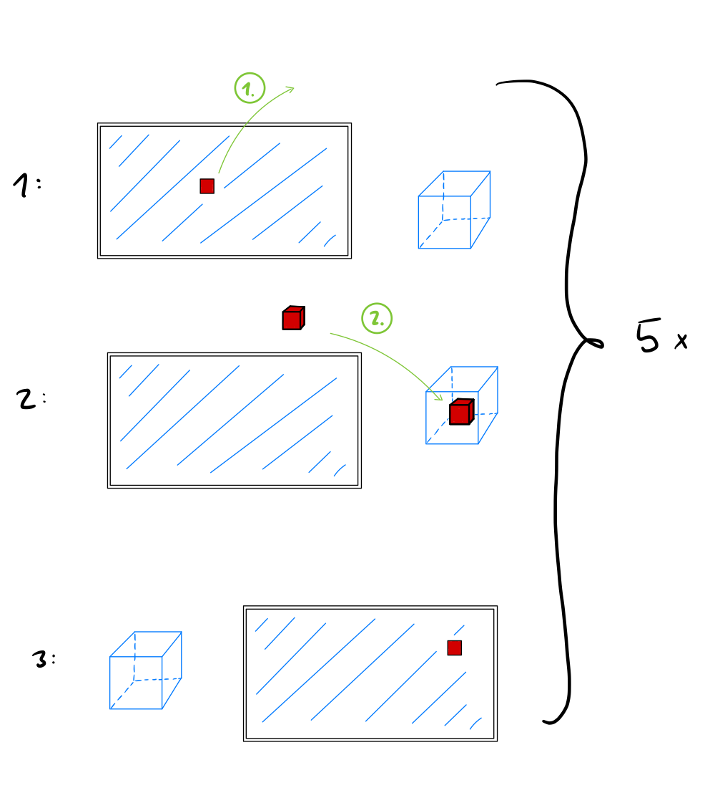

# PhysComp SS24 Assignment - Week 9

> **Deadline:** 25.06.2024, 23:59 CEST

## Weekly Progress Report
1.	**Progress Report:** What have you achieved this week with regards to your project? As usual, if your *concept* has changed, briefly describe this (and post pictures). 
Also, report on your progress in *developing your prototype* or *acquiring equipment*.

This week, we built upon our previous successes with mouse components and shifted our focus to integrating a Vive Tracker into our project. Our objective is to utilize the Vive Tracker as a VR controller by positioning it on top of our Spatial Mouse to enhance its functionality.

While we made some headway, we encountered challenges on the software side of the integration. We successfully established a connection with the Vive Tracker and achieved tracking capabilities. However, we're still working on integrating it into the Unity software to be able to read the tracking data of the Vive Tracker in Unity. Here, our goal is to configure it to function as a fully operational VR controller within our system.

This integration process has proven more complex than initially anticipated. Despite the hurdles, we remain committed to resolving these issues and are actively exploring various solutions to achieve our desired functionality.

Moving forward, our primary focus will be on overcoming the software obstacles preventing the Vive Tracker from operating as a VR controller in our setup. We're optimistic that with continued effort and problem-solving, we'll make significant progress in the coming week.

## Refine Evaluation Plan
2.	**Refine user task and measurements:** please revise and refine your evaluation plan based on the feedback you received. 
For most, this means to just specify the user task a bit better, so that you can really take away some meaningful learnings from the evaluation. 
Some of you may also wish to review the questions you ask participants (consider how you can find evidence that your prototype solves the "problem" you aim to address).

Specify our user task:
For our user study our idea was a task with which the user needs to repeatedly switch between the computer mouse component and the VR controller component as the device input. This could be a sequence of moving icons out of the monitor and dragging windows and objects around in the environment.
To specify this, we created a little sequence:
1. A red square spawns at a random position on the virtual monitor. With the help of the mouse function of the Spatial Mouse, this square can be moved on the virtual monitor and can also be dragged outside of the virtual monitor. When it is outside, it changes from a 2D square to a 3D cube, indicating it is now a 3D object, which can be moved with the VR controller function of the Spatial Mouse.
2. The user needs to move the red cube with the VR controller into a large blue 3D cube. When the red cube is inside the large blue cube, the subtask is finished, and the red cube disappears.
3. The red cube reappears on the virtual monitor at a new position, and the position of the blue cube also changes around the monitor.

This sequence should be repeated 5 times.

{width=500px}

With a user task like this we are focusing on repeatedly switching between the mouse function and the VR controller function to evaluate its effectiveness and user satisfaction. Additionally, we believe that incorporating a more "playful" task, such as a simple game, would be beneficial. However, since both of us have limited experience with Unity, we will proceed by attempting to implement this study task.

3. **Review Norman’s design principles**: Issues during interaction may occur if you fail to fully address these design principles. So, take advantage of the user evaluation to reflect on these again.
Look up the design priciples in the lecture slides and list at least 2 specific principles that are particularly relevant for your prototype at this stage. Then integrate a task or question in your evaluation plan that allows you to check whether you address these principles well. Describe your planned approach.

*Hint:* You will presumably all want to ensure visibility. You can evaluate this by observing and asking e.g., whether users understand the current system status or whether available functions are easily recognized/found.

### 1. Visibility:

Crucial since users need to clearly understand the current status of the device and easily recognize its functions.

Evaluation task: Ask users to identify and explain the purpose of each button or control on the device without prior instruction?

Planned approach: We will observe users when interacting with the Spatial Mouse for the first time and ask them to think aloud while exploring spatial mouse.
Make notes on which functions are directly apparent and which are not. 
Potential Questions: 
1. Can you tell me what this button does?
2. How would you use this device to perform Action X?
3. Is there any part of the device that is unclear to you ?

### 2. Mapping:

Evaluation task: Users perform a series of simple VR and mouse tasks, focusing on how well the physical movements translate to actions. 

Planned approach: We are going to set up an environment with basic interaction tasks (pointing, selecting, moving objects, etc). Next, we will ask the users to perform these tasks with the Spatial Mouse and observe their actions.

Potential Questions:
1. Describe how the movement of the device in your hand relates to what you see in VR?
2. What happens in VR if you press that button? Is it what you expected?
3. Tell me about any actions that felt natural/unnatural when using device?

