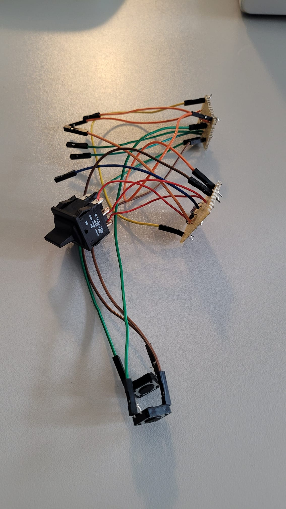

# PhysComp SS23 Assignment - Week 10 Progress Report

## Progress Report

This week, we made significant strides in developing our spatial mouse project, focusing on both software and hardware aspects:

1. **VR Integration**: We successfully familiarized ourselves with Unity and SteamVR, crucial platforms for our project's functionality.

2. **Vive Tracker Implementation**: We configured the Vive Tracker to function as a VR controller. This is a critical component as it will be mounted on top of our spatial mouse.

3. **Hardware Integration**: With the Vive Tracker setup, we've concluded the hardware integration phase. All necessary components are now functional and ready for the next stage.

4. **Component Confinements**: We 3D printed small confinements for individual hardware devices (mouse sensor, tactile switch, and two buttons). This strategy allowed us to quickly iterate and modify sizes without printing the entire prototype. Each confinement took only 10-30 minutes to print, compared to the 8 hours required for a full prototype.

5. **Hardware Assembly**: We soldered the hardware components and wires together. Initially, we considered using a perfboard (a thin board similar to a breadboard where components can be inserted and soldered on the back). However, we were unsatisfied with the result, primarily due to the board's stiffness making it cumbersome to integrate into the spatial mouse. Instead, we opted to solder the components directly with wires, which proved easier to fit inside the hollow grip of the spatial mouse.

6. **First Prototype Printing**: We completed our first full prototype print. This process took about 8 hours but provided valuable insights. Upon completion, we identified several areas for improvement, particularly regarding the integration of hardware components into the printed structure.

7. **Design Iteration**: Based on our observations from the first prototype, we designed a modified shape. We initiated an overnight print of this revised prototype in preparation for our next lab session.

8. **Unity Project Expansion**: We expanded Robin's Unity project to accommodate the use case of the spatial mouse, which now works with the vive tracker and our self created mouse. Furthermore we created a study environment in Unity, where the participants need to solve four tasks.

### Picture Collection:

First Prototype

{width=500px}
{width=500px}
{width=500px}

Current Prototype

{width=500px}
{width=500px}
{width=500px}

Cable Layout/Soldering

{width=500px}
{width=500px}
{width=500px}
{width=500px}
{width=500px}
{width=500px}
{width=500px}

Developing Unity Environment

{width=500px}

## Milestone Review

### Achieved Milestones

1. **Milestone 1: Decide on a Design**
   - Status: Completed
   - We've successfully finalized our design concept and are satisfied with the current plan.
   - Note: The design's practicality will be fully assessed once we build the physical form.

2. **Milestone 2: Test Functionality**
   - Status: Completed
   - All individual components have been tested and integrated successfully.
   - The prototype meets our desired functionality requirements.

3. **Milestone 3: Build the Components into a Prototype**
   - Status: Completed
   - Next steps: Design a shape that accommodates all components.
   - This phase is crucial for identifying necessary design improvements.

### Pending Milestones

4. **Milestone 4: 3D Print the Spatial Mouse**
   - Status: In Progress
   - Dependent on the completion of Milestone 3.
   - Will involve 3D printing the final design and assembling all components.

## Updated Project Plan

Given our current progress, we've adjusted our project plan to focus on the final stages:

1. **Prototype Evaluation** (1 week)
   - Assess the new prototype print
   - Gather feedback from peers or potential users
   - Identify any necessary further modifications

2. **Final Design Iteration** (3-4 days)
   - Make any final adjustments based on feedback
   - Conduct a final print if required

3. **Project Finalization** (2-3 days)
   - Assemble the final version
   - Conduct final testing and documentation

We aim to complete these tasks within the next three weeks, aligning with our project deadline. This revised plan allows for iterative improvements and ensures we deliver a fully functional spatial mouse prototype.

## User Study

This project includes a user study to evaluate the usability and effectiveness of the SpatialMouse in a virtual reality (VR) context. The study is designed to assess how users interact with the SpatialMouse when manipulating 3D objects in a simulated environment.

### Study Procedure

1. Introduction
   - Welcome participants
   - Introduce the researcher
   - Explain the SpatialMouse and its purpose
   - Outline the study's objectives

2. Study Overview
   - Present a simulation model (Uterus Frozen tissue)
   - Demonstrate setting up the SpatialMouse probe
   - Explain the main task: Using the SpatialMouse to move 4 objects from a screen into a VR environment

3. Data Collection Methods
   - Think-aloud protocols during task performance
   - Short questionnaires at multiple stages
   - Observation of user interactions

4. Study Flow
   - Obtain participant consent
   - Administer initial short questionnaire
   - Conduct first think-aloud session with SpatialMouse
   - Administer second short questionnaire
   - Conduct second think-aloud session
   - Administer final short questionnaire

5. Objectives
   - Assess user experience with the SpatialMouse in a VR context
   - Identify potential usability issues or areas for improvement
   - Gather feedback on the effectiveness of the SpatialMouse for manipulating 3D objects in VR

We will hand out [this](./Figures/study-2.pdf) consent sheet and [this](./Figures/SpatialMouseAlle.pdf) questionnaires.